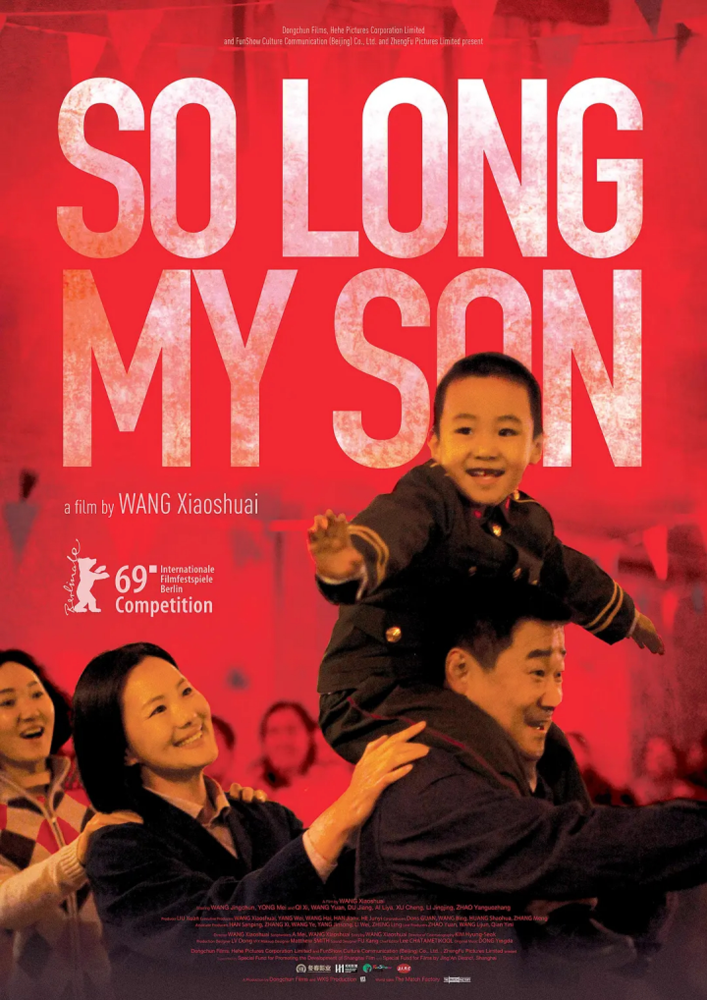

# ***给儿童节最好的礼物 —— 儿童节不要堕胎***

 

 

 

每当任何社会错误地认为任何人是比人类低一级，不值得去珍惜和尊重，人类大屠杀的文化背景就出现了！

—— 布雷南(William Brennan)

中国每年新生婴儿约2000万，每年人工流产的胎儿高达1300万。20到59岁的中国女性中，有过人工流产的比例为62%，而在西方世界性自由最泛滥的荷兰，这 一数字为5.1%。

——《中国日报》

 

## ***第一部分：堕胎的真相***

### ***现代科学对人类生命的开始有何结论？***

很多人误以为堕胎是一个「宗教」议题，其实不然。它是一个科学问题，尤其是一个生物学的议题。现代科学的结论是非常清楚的：人类生命开始于受孕的时候。 这是科学事实，不是哲学、推测、意见、猜想，或者理论。今天，生命开始于受孕之时，是一个证据确凿的事实，没有一个理性、诚实、有知识的科学家或医生能够否认这点。

1973 年，美国高等法院判决著名的「罗伊诉韦德」(Roe v.Wade) *判案时说，他们没有必要裁决生命何时开始这个「难题」。为什么？其实，他们说的是：「我们无法决定生命是什么时候开始的」。法庭在当时误导了众人，而被误导的人，今天也继续误导大众。

1971 年10月，在「罗伊诉韦德」案之后，220 位杰出的医生、科学家和教授联署，向高等法院递呈一份顾问摘要（此类文件乃是就某法律问题向法庭提出建议）。他们向法院说明，现代科学已经证实了人类生命是延续的，未诞生的孩子，从受孕的那一刻起就是一个人，应该和其母一样，被视为人。

事实上，在「罗伊诉韦德」案之前，几乎每一本医学和生物学的教科书都认为「小孩子从一个单细胞发育而成的过程是相当神奇……当女性的卵子从男性受精之后，人类的发育是一个不断的过程，单细胞的受精卵生长和变化……最后变成一个多细胞的成人。」

世界有名的遗传学家李居讷(Jerome Lejeune)博士是法国巴黎迪卡大学的基础遗传学教授，他声明说：「每个人都有个非常独特的开始，就是受孕那一刻。」博士也强调：「从受孕到年老，人类的人性不是一个玄学上的主张，乃纯粹是一个实验的证据。」

医生、生物学家和其它科学家都同意，受孕是一个人生命的起始点——此一个体是有生命的，且是人类的一份子。在无数的医学、生物学和科学文献中，对于这一点有压倒性的一致看法。

在此重申，这不是一个宗教问题，完全是科学问题，科学家们不论有什么宗教信仰或没有宗教信仰（不可知论者、犹太教、佛教、无神论者、基督徒，印度教等），都同意生命开始于受孕之时。这就可以解释为什么国际医学道德法典声明：「一位医生必须时刻谨记保存人类从受孕直到死亡的生命之重要性。」

人类生命是否始于受孕，究竟有何差别？其差别就在于：若人类的生命始于受孕之时，那么，堕胎就是谋杀。

注：「罗伊诉韦德」案是关于美国德萨斯州德一名未婚怀孕女子，因为德萨斯州的法律禁止堕胎，无法获得合法堕胎。当时美国有几个州是允许堕胎的，可是她没有路费前往。最后她上诉美国高等法院获胜，她的案件影响了美国其他五十个州同时通过堕胎合法化，轰动一时。可是今天，这位女主角已经是一位重生的基督徒，并且大力反对堕胎。

 

※ ※ ※

### ***现代科技怎样证明人类生命开始于受孕之时？***

 

超音波技术好像是给子宫开了一扇窗户，这是我们第一次亲眼看见里面的胎儿，在此之前，我们从来未能如此做。藉由超音波，我们取得这些非常清晰的照片，让我们可以刺激胎儿，看他怎样呼吸，怎样活动，怎样吞食，怎样排尿，观察子宫里的一切动静。

受精后两星期出现的一个小囊，三到三个半星期后，我们可以看见心脏开始跳动。这样就修正了我们许多有关胎儿的资料。这一切都在在说明， 人类生命的开始，除受孕的那一刻以外，别无任何实点（例如，有生存能力时）可以作为起点。请参考纪录片《子宫日记》。

※ ※ ※

### ***胚胎或胎儿怎么会是人？岂不是一个「将是而未是」的人吗？***

支持堕胎的人声称在子宫内活着的胎儿不是完整的人，只是「将是而未是」的人，因此不足以得到宪法对人的保护，可以堕胎来中止其生命。 认为胎儿必须能够在母腹外过一个「有意义」的生活才算是一个人，这个判定有什么错误？问题是他们没有为「有意义」下一个定义。有些人认为有意义的生活，其它人不一定同意。谁来决定？

 

字典怎样给人格(person)下定义？《牛津美国字典》(Oxford American Dictionary)的定义是「个别的人」。换言之，一旦证实了(我们已经讲过) 受精卵是「个别的人」，你就证实了它是一个人。人格的客观定义就是字典中的定义，也是生物学上的定义——「个别的人」。

所以，宣称一个有生命的人不一定是一个有人格的人，是错的，「有生命的人」和「有人格的人」之别是勉强的，基本上，「有生命的人」和「有人格的人」无大差别。

这是什么意思呢？这就是说：堕胎是谋杀，是谋杀人类；没有人可以不关心这件事。

※ ※ ※

### ***堕胎的时候，有什么事情发生？***

堕胎被默许的原因之一，是因为他们看不见堕胎手术对腹中胎儿的影响。我们的电视堕胎节目也被审查，电视台禁止播送。

大部分的堕胎是在前十二个星期内进行的，胎儿还很小，可以用一个强力的抽吸器把他吸出，这个抽吸器的能力是普通家用吸尘机的二十五倍。这个方法叫做抽吸割除术，抽吸器的力量撕裂或者绞拧胎儿的身体，将肢体逐部撕开，直至剩下头部。胎儿的头部太大，不能从吸管中通过，所以堕胎的人需要用钳子插入子宫内，攫获这个单独漂浮的头部，然后将它钳碎，直至能够通过抽吸管，然后头部也就被挪走。

另一个堕胎程序叫做钳刮术。这个程序通常用在第四到第八个月。子宫颈被扩大，插入子宫的不是抽吸器，而是手术钳，把胎儿的身体夹着，逐部拧掉，一块一块的取出，然后将脊骨和头颅骨压碎拔出，另外用一把割除器或者锋利的椭圆形刀子刮干净。「为了减轻子宫口的损伤，胎儿被分成细块抽出，因为胎儿头部的尺寸和形状，通常是最难被压碎和拔出的，工作人员要数点胎儿的每一块骨胳……」

另一个堕胎手续是盐毒法，通常用在第四到第七个月。这个手术是用一支约9cm到10cm的针，从母亲的腹壁插到羊膜囊中，抽出200ml的羊水，然后以一种强度的浓盐水替换。在这个程序中，胎儿会把盐吞掉，在盐中「呼吸」，基本上，胎儿全身的皮肤被盐烫伤，慢慢被毒死，于是母亲开始分娩，排出一个死的、烧伤的和枯萎的婴儿。

 

 

其它堕胎办法是用前列腺素激发的。前列腺素包含一些荷尔蒙类的化合物，当注射或使用在子宫肌的时候，可以损坏胎儿的血液循环，产生剧烈的收缩，然后被排出。因为前列腺素对未诞生的胎儿不是直接有毒，这样的堕胎方法可能比盐水法产生更多因打胎失败而出生的胎儿。通常，如果孩子生出来仍然活着的话，他们就让他饿死，也有勒死或者杀死的。

很多国家都报导，愈来愈多医生因为参与堕胎内疚而沮丧崩溃。

 ※ ※ ※

### ***婴儿在堕胎的时候是否会感觉痛楚？***

早在1981年，有些研究员强烈地认为未诞生的胎儿早在八个星期大就能够感到痛楚。

加州大学柏克莱分校法学院的奴南(john T.Noonan, Jr.)教授形容这些堕胎手术怎样给胎儿造成痛楚：

这些经历是痛苦的吗？一把锋利的刀子插入皮肤，有生机的器官被破坏，对任何有感觉的生物而言，不可能不痛苦。这个手术需要十分钟。被抽吸器抽吸是痛苦的，被抽吸器肢解也是痛苦的。从抽吸器开始作用，到胎儿身体大部分毁坏，也是十分钟。如果高浓度盐水意外地从皮肤进入堕胎中的妇女身体，它会引起「剧烈的和严重的痛楚」。我们可以推想，未诞生的胎儿可能有两个小时的类似经历，因为盐水需要两个小时才能叫胎儿的心脏停止。

现代人花大量的财力物力去抢救熊猫、流浪狗、流浪猫、甚至猫头鹰，这个时代的人非常关心［动物的权利］，却否认胎儿生命的权利，他们痛苦的时候，我们硬着心，调头不顾，叫人难以置信！我们视他们为低一等的人类，对待他们还不如动物。

※ ※ ※

### ***堕胎对妇女是否一个完全安全的手术？这对身体有什么危险？***

大部分人向来相信堕胎是一个安全的手术，那些支持堕胎的人，不断地告诉我们：无需担心。可是这个想法是错的。在查阅「大量有关这个题目的医学文献」之后，希格(Thomas W.Hilgers)医生总结到：「堕胎在医学上的危险是非常大的，应该认真去衡量。」

千千万万的女性已经在肉体上付出代价，还有更多的女性为堕胎而付上终极的代价：成千上万的女性因此而死去。

一项来自世卫组织的系统分析显示，在孕产妇死亡的原因中，有7.9%是由流产造成的，其中有45%是不安全流产。

我们在此简短地列举堕胎对身体可能有的影响：

死亡/子宫穿破/因为出血而需要输血(可能感染肝炎或艾滋病)/撕裂子宫颈，对子宫颈有未明的伤害，影响它以后怀孕的功能/因麻醉药而有的意外，包括痉挛、休克、因麻醉药中毒而心脏停止/骨盆发炎，可能引起不育/非预期的外科手术，包括剖腹术、子宫测量术和子宫切除术/膀胱穿破/肠子穿破/出血不止/ 组织滞留/贫血/腹膜炎/不明原因的轻微感染和发烧/难以察觉的输卵管宫外孕/肺动脉阻塞/血栓静脉炎/沮丧/精神病/自杀

很多经历到以上问题的妇女，非常气愤，因为没有人在堕胎前将这些后果警告她们。不幸的是，这些后果也不是事前可以预知的。接受堕胎的妇女是在玩火，不但危害自己的身体健康，而且影响她以后的怀孕，她的心理健康，甚至她将来的孩子健康都受到影响。

很明显，那些以堕胎为职业的医院和医生在很大程度上隐瞒并且美化了堕胎对身体的影响。

※ ※ ※

### ***圣经怎么看待生命？***

旧约圣经用同一个希伯来字称呼未诞生的胎儿、婴孩和孩童。新约圣经用同一个希腊字形容未诞生的胎儿、婴孩和孩童。这就指出从受孕到童年，再到成年都是一贯的。

希腊文中的βρέφος（brehpos）指刚刚诞生的，婴儿和稍长的孩子（路二12、16、十八15；彼前二2）。例如，在使徒行传七章十九节中的βρέφος（brehpos）指法老下令所杀的孩子，但是在路加福音一章41、44节中，指母腹中的施洗约翰，一个未诞生的胎儿。

在上帝的眼中，胎儿和一个孩子没什么不同。

希伯来字יֶ֫לֶד（yeled）通常是指孩童（譬如，孩子，男孩等等）。但是在出埃及记二十一章22节，这个字也指母腹中的胎儿。

 

所有这些经文和许多其它的经文都指出，上帝没有区分未诞生的生命和已诞生的生命，也没有划分人格的阶段，也就是母腹中未诞生的胎儿和已经诞生的婴儿没有什么不同，圣经屡次显示从受孕到成年，一直都算为一个人。事实上，圣经中没有一个字是单指未诞生的胎儿，可让我们在人格和价值上区分已经诞生的和未诞生的。

 

诗人在诗篇一三九篇16节说，「我未成形的身体，你的眼睛早已看见」。诗人用גֹּ֫לֶם（golem）翻译为「身体」的这个字，形容自己在母腹中。他用这个字形容上帝对他的照顾，即使在最早的胚胎期（孕体移植子宫后的几个星期），就是胎儿「成形」为一个雏型的人的阶段，上帝亦看顾。我们知道4到5个星期之前的胚胎是「未成形」的。换言之，即使是「未成形的身体」的妊娠阶段（0-4星期），上帝也说他照顾和塑造这个孩子 （诗一三九13-16）。

从上面的经文看来，我们必须承认圣经指出人的生命属于上帝，不属于我们。圣经教导说人人终究属于上帝，因为人人都是上帝所造的。既然生命都是上帝所造的，也是属于他的，没有人有权利可以谋杀上帝所创造的 （出二十13）。

十诫中的第六诫说，「不可杀人」（希伯来文是“不可谋杀”）。因为已经有科学证据证明胎儿是一个人，这个诫命也可以应用在堕胎上。「不可杀人」就等于「不可堕胎」。

※ ※ ※

## ***第二部分：社会现状***

在全世界范围内，人类数千年文明史中，中国是唯一通过行政手段强制执行计划生育，并将其写进宪法的国家，由此也引发大量的人权问题。

实行计划生育的官方理由是人口总量多导致人均资源少，但那些人均资源比中国少，人口密度比中国大，人口总量即将超越中国的国家都未强制实行计划生育。全世界大部分国家所面临的问题都是出生率太低而需要鼓励生育，中国实行计划生育的预期目标也逐一破产，计划生育所解决的问题远远不及它所制造的问题。

1980年独生子女政策的理论依据全部破产，1980年宋健（独生子女政策总设计师）认为：

1. 如果不实行计划生育，2000年中国人口要过14亿，2050年中国人口将达到40亿。 
2. 中国最适人口是7亿。
3. 实行独生子女政策后不会出现性别比例失衡。
4. 老龄化现象最快也得在2020年以后才会出现。 
5. 实行独生子女政策后不会出现劳动力不足。 
6. 英国希望将人口减少 46%， 荷兰希望将人口减少63%。
7. 短期预测的精度与人口普查精度一致，长期预测精度也能保持在百分之几的水平。

**现实**

1. 没有考虑经济发展可自发降低生育率，短视地以为人口会无限增长。 
2. 最适人口理论是伪科学。 500年前，中国最适人口只有数千万。 
3. 几年后性别比例就拉大，现在已经高达100:120-130，数千万女婴到哪里去了？
4. 1999年中国就进入老龄化。梁中堂认为宋健在结果解释上瞒天过海。
5. 早已出现民工荒。国务院2006年调查：74%的村庄已无青年劳动力可外移。
6. 英国、荷兰不但没有控制生育，反而鼓励生育。
7. 仅仅过了几年，中国的首次百年人口预测结果就已远远脱离实际。

＊以上数据源于学者易富贤所著《大国空巢》。

 

### ***计划生育导致部分的社会问题：***

1. 性别比例失衡；
2. 人口老龄化，社会劳动力不足，养老制度难以维持，社会丧失可持续发展的基础；
3. 兄弟姊妹的消失，导致大量独生子女心智发展不健全；
4. 家庭结构改变，传统家庭伦理结构的崩溃；
5. 失独问题；
6. 赡养问题；
7. 强制计生带来的侵犯人权；
8. 违反宪法；
9. 征兵困难；
10. 计生罚款滋生腐败。

※ ※ ※

### ***圣经的生育伦理与人的“计划生育”***

无所不知的上帝在圣经中从来不提“计划生育”，却反复叮嘱亚当、挪亚、 亚伯拉罕、以撒和雅各：“生养众多，遍满地面”（创世记1:28），“生养众多，在地上昌盛繁茂”（创9:1,7），“后裔如同地上的尘沙那样多”（创 13:16），“后裔极其繁多”（创17:6），子孙“如同天上的星，海边的沙” （创22:17），“我要加增你的后裔，像天上的星那样多”（创26:4），“我是全能的神，你要生养众多”（创35:11）。

照说那时“生产力”水平低下，所能分配的物资极其有限，上帝就不怕人生养众多会没有饭吃？可是圣经从不提计划生育。再考察圣经，发现上帝 “生养众多”的诫命都与给人的另一使命“治理这地”相连：原来人在地上尊贵如君王，要为上帝看守美丽富饶的大自然。这伟大使命还包括了人可享用上帝为我们造的这一美好世界的权柄：你不仅可以杀牲吃肉，而且你生得越多，我供应你越多（参见《创世记》9:3）。

可是20世纪的人类文化偏偏要反其道而行之：大力节育。马尔萨斯《人口论》小书一本，竟是20世纪影响人类的50本最重要书籍之一。他根据数学原理认为：人口增长几百倍，土地产量却只增几倍、几十倍，资源紧缺， 所以要限制人口。于是，20世纪越富越文明的国家越节育，越穷越无文化的越生。人们以为孩子越少（最好没有）生活越好。短期内表面上是如此，但长期后果则不然：在“不生”已成习惯的欧洲和日本，长期人口负增 长，他们正慢慢把自己灭绝掉。凡节育不生的地区和国家的人，内心空洞越来越大，人觉得形单影只，活得没意思。过分节育的日本，百年后人口只有今天的20%；新加坡在曾经实行的节育政策下，如今要从中国进口司机，从马来西亚和印尼甚至非洲进口建筑工人......一系列人口危机皆因违背上帝的旨意而产生。

中国在这节育大潮中最为抢眼：我们是全球唯一用暴力强制计划生育的国家。把上帝“生养众多”的祝福变成了咒诅， 他们为私利而在人口问题上翻云覆雨，把自己当成了主宰人类生育规律的神。

70年代后期，面对解决不了的经济崩溃现状，把“计划生育”当做脱困工具。1982年3月13日，把计划生育定为“基本国策”，许诺：30年后可采取不同的人口政策。1982年这一年就堕掉1400多万胎儿。至今30多年过去， 人流者每年至少600万以上，30年来，有4亿个来不及叫妈妈的幼小生命被杀死。

2015年10月26日到29日，宣布加速开展全面二胎，在实行30余年的一胎化政策正式走入历史。年轻女性的怀胎率却持续出现创历史新低的下跌，经历连续三年的减少，2020年已经降至约1000万人，除较预期严重之外，部分地区陷入失衡，甚至损失了32%的新生儿，再创1949年战后的新低，学者指出东北人口在早期出现生育率警讯的时候，并没有获得全国范围内的重视。为进一步解决人口增长急速下降的问题，应对人口老龄化，又于2021年5月31日宣布实施三孩政策并开始提供促生配套措施。

联合国经济和社会事务部人口司司长约翰·威尔莫斯（John Wilmoth）说，“中国人口在 2022 年达到了14亿的峰值，并且已经开始下降。预测表明，到本世纪末，中国的人口数量可能会下降到10 亿以下。相比之下，印度的人口预计将持续增长数十年。2022 年，中国是世界上生育率最低的国家之一。”

世界现在人口80亿，中国14亿，印度人口也超过中国。联合国有关机构曾统计：整个地球的农作物最保守的估算，可养活120亿人口。上帝造的世界够大，也够丰盛的。中国、朝鲜、前苏联之所以和平时期饿死那么多人，完全是因人的罪恶蹂躏了土地。照过去这种竭泽而渔的发展模式，十个地球也不够糟蹋。

※ ※ ※

## ***第三部分：我们为什么反对堕胎***

我们是一群相信上帝和《圣经》的基督徒。《圣经》宣称，生命是被创造的， 是上帝赐下的恩典，生命是从母腹中开始的。未出生的胎儿亦是人，而不是一块无生命的肉。犹太人的《摩西律法》中规定，“禁止妇女堕胎和治死胎儿”。《新约》中，耶稣的使徒们把使用有毒药物等方式的人工堕胎， 称之为“邪术”。在古希腊文明中，有一位希波克拉底医生，他曾写下著名 的“希波克拉底誓言”。迄今为止，这个誓言仍是西医教育体制中的每一位毕业生、在进入临床服务之前的医师誓言的蓝本。希波克拉底也因此被称为西方医学之父。“希波克拉底誓言”中这样说：

神明为证，我们敬谨直誓，愿以自身能力及判断力所及，遵守此约。我将依据自身的能力与判断，采用对病人有利的疗法和处方，绝不施以有害或有毒之物。无论因何人之请，我也绝不给予致命药物或做此类之建议，也决不协助妇女堕胎…

若我遵行此一誓言，不懈不怠，愿上天使我乐享生命、精进医业并受世人敬重。若我违反誓言，愿我遭相反之命运。

近年来，因为3D超声波和4D动态三维摄像技术的发展，胎儿在母亲子宫里的成长，开始逼真地呈现在人类眼前：

• 第8周：小家伙已具有人的形象和样式；

• 第9周：小家伙开始有动作，把母亲的子宫壁当作跳床，常作踢腿练习。

• 第12周：小家伙的大脑运作，能够观测到脑电波。

• 第16周：小家伙的动作开始由大脑控制，第一次睁开眼睛，觉察到周围的空间，甚至对母体外的刺激都有反应。

• 第19周：小家伙开始兴致勃勃地吞羊水，玩耍脐带，甚至用手把它缠绕在自己身上。

• 第24周：小家伙开始具有独自存活的能力，在母腹中打哈欠，用手玩鼻子，甚至还会做梦。

有人会说，中国目前的法律没有确认胎儿的生命权利。但在《继承法》中， 我们却看到对胎儿利益的明确保护：

第二十八条 遗产分割时，应当保留胎儿的继承份额。胎儿出生时是死体的，保留的份额按照法定继承办理。

有利可图的时候，我们就承认胎儿是人；利益受影响时，我们就选择杀死胎儿。还有比这更无耻的做法吗？

本部分内容主要摘自美国安克伯&韦而登所著之《堕胎的真相》

  

 

## ***我们的立场：***

 

我们反对除危及母体生命或胎儿没有心跳以外的堕胎。

我们主张，医院必须告知堕胎者，堕胎以外的选择，及堕胎有可能的一切危害，并提供给堕胎者反对堕胎的理由和资料。

我们主张社区和学校宣传胎儿生命的科普教育，及向未成年普及正确的性知识。

我们建议社会、政府为无力抚养但愿意选择生产的妈妈给予社会保障并提高物质支持。

我们倡议，将儿童节作为“守护生命日”，守护在母腹中的胎儿，因为这一天，也是他们的节日。以此提醒我们，敬畏生命，反思我们的道德，悔改我们的自私。

 

- 邀请你：将这份资料传递给更多的人。

- 当你生命中遇到这样的处境（或者有类似遭遇的朋友），鼓励你以敬畏生命的态度去做决定（帮助对方）。

- 若有需要，也请联系我们。 yogurt777@protonmail.com

我们呼吁所有敬畏生命、敬畏道德、敬畏上帝的成都市民，加入到我们的倡议中来，一起为我们宝贵的未来发声！

 

 